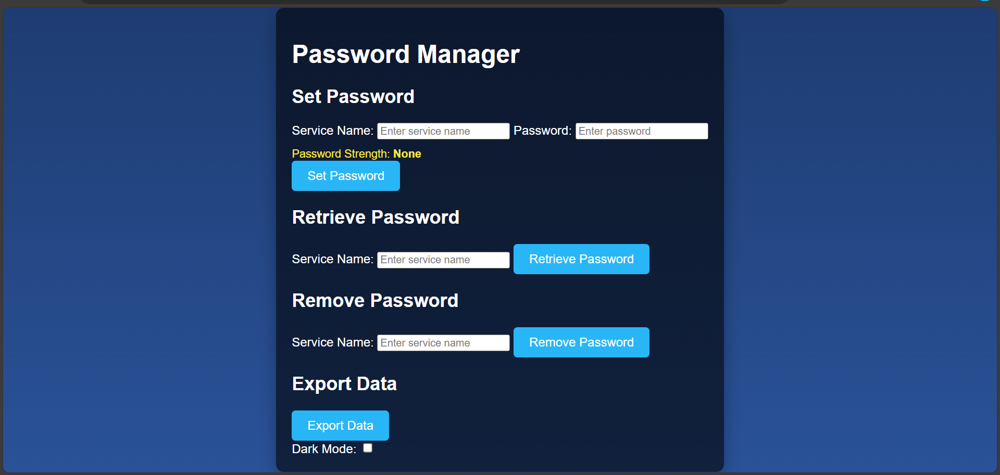
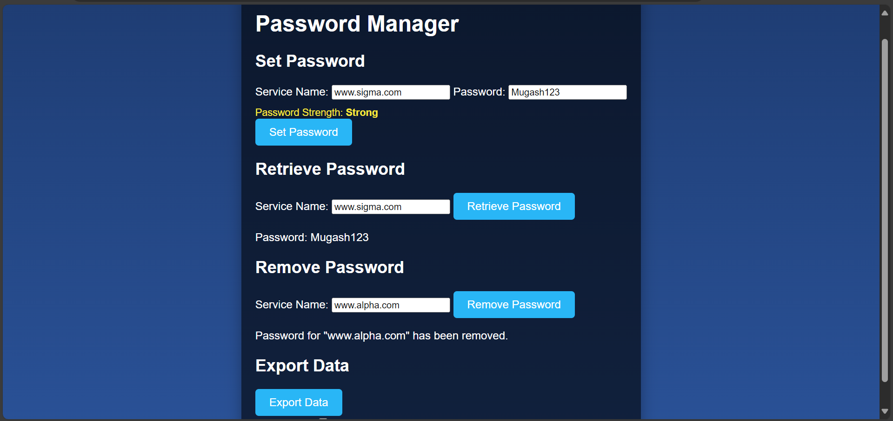
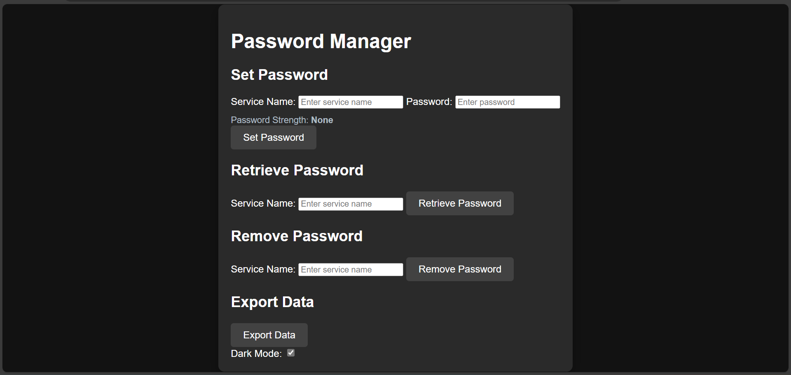

# Password Manager 🔐  
**A secure, user-friendly password management solution with robust functionality and an intuitive, stylish GUI.**  

## 📜 Overview  
This Password Manager is a feature-rich application designed to help users securely manage their passwords for multiple services. Built with a strong emphasis on security and usability, it includes functionalities for adding, retrieving, and removing passwords, as well as exporting data securely for backup purposes. Its sleek, modern interface enhances user experience while maintaining robust security.

---

## ✨ Features  
- **Password Management**:
  - Set, retrieve, and delete passwords for various services.
  - Robust encryption ensures passwords are securely stored.

- **Security**:
  - Uses advanced cryptographic techniques (AES-GCM and HMAC) to encrypt and authenticate data.
  - Detects tampering and protects against rollback attacks.
  - Passwords and service names are never stored in plaintext.

- **Password Strength Validation**:
  - Ensures users create strong, secure passwords.

- **Data Export**:
  - Export encrypted password data to a secure JSON file for backup purposes.

- **Enhanced User Interface**:
  - Stylish and responsive GUI with animations and dark mode for better usability.

---

## 🚀 Highlights  
- Built using modern JavaScript with browser and Node.js compatibility.
- Includes comprehensive unit tests using Mocha to ensure reliability.
- Highly secure implementation using Web Crypto API.

---

## 📷 Screenshots  
**Main Interface:**


**Main Interface at work:**


**Dark Mode:**
  

---

## 🛠️ Installation & Usage  
1. Clone the repository:
   ```bash
   git clone https://github.com/yourusername/password-manager.git
   ```
2. Navigate to the project folder:
   ```bash
   cd password-manager
   ```
3. Install dependencies:
   ```bash
   npm install
   ```
4. Start the application (localhost environment):
   - Place the project in an Apache server (like XAMPP) in the `htdocs` directory.
   - Open the application in your browser:
     ```
     http://localhost/password-manager/index.html
     ```

5. Run Tests:
   ```bash
   npx mocha
   ```

---

## 👨‍💻 Technologies Used  
- **Frontend**: HTML, CSS, JavaScript (with ES Modules)  
- **Backend/Logic**: Secure cryptographic operations using Web Crypto API  
- **Testing**: Mocha  
- **Version Control**: Git  

---

## 🤝 Contribution Guidelines  
Contributions are welcome! If you'd like to add features or improve the project, please fork the repository and submit a pull request. Ensure your code adheres to the project's coding standards.

---

## 🛡️ Security & Disclaimer  
This application is a learning project and should not be used in production for managing sensitive information without further security audits and enhancements.  

---

## 📄 License  
This project is licensed under the MIT License. See the [LICENSE](LICENSE) file for details.

---

## ⭐ Why Use This Password Manager?  
- **Secure**: Implements industry-standard encryption and authentication.  
- **User-Friendly**: A clean, modern interface makes password management easy and intuitive.  
- **Educational Value**: Understand cryptographic principles and secure application design. 
